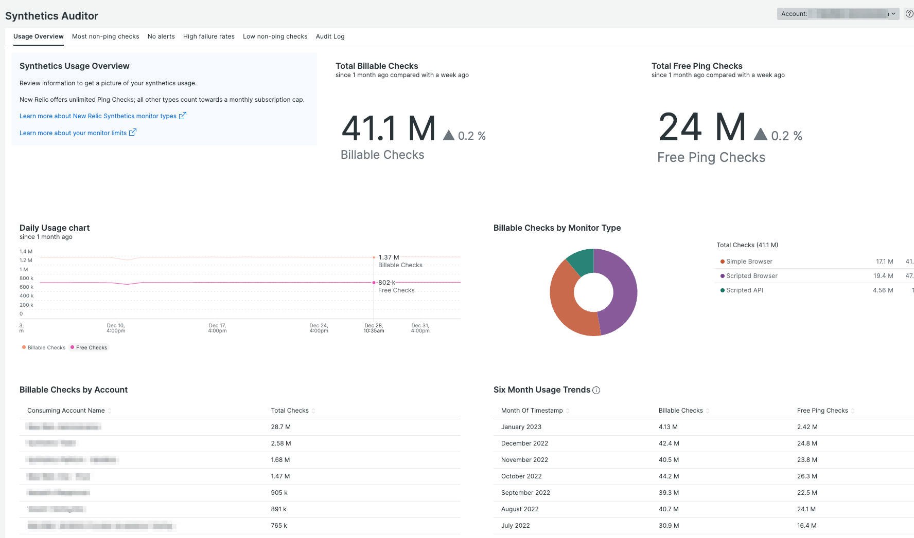
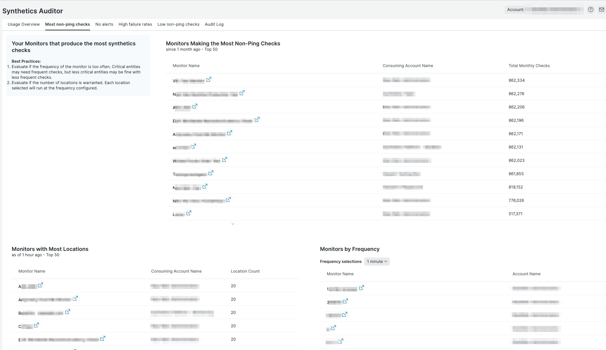
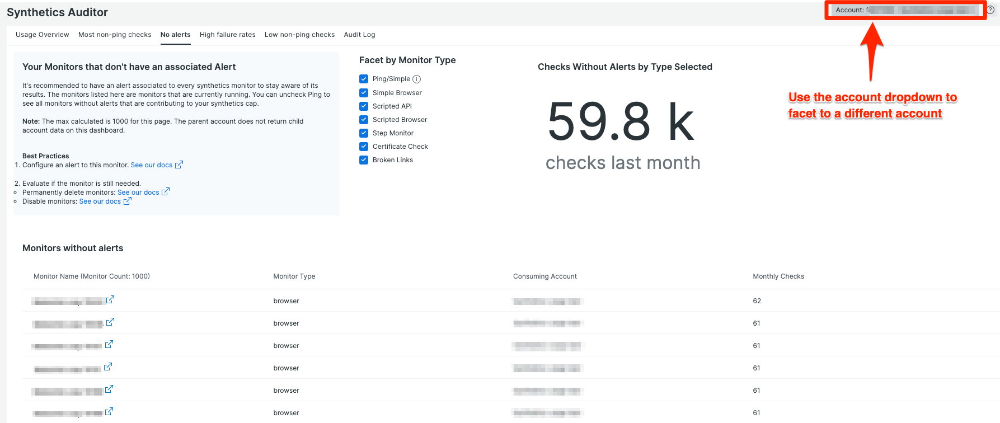

[](https://opensource.newrelic.com/oss-category/#new-relic-experimental)

# New Relic One Synthetics Auditor

## About this Nerdpack

Synthetics Auditor for New Relic One is designed for a quick view into your Synthetics usage across accounts. It uses the power of Nerdgraph and NRQL to answer your questions about your synthetics monitoring.

The goals of this app are to provide insights on:

* Synthetics usage across accounts as an overview
* Monitors creating the most billable checks (ie, non-Ping type monitors) including high frequency and high location number monitors
* Monitors that do not have alerts associated to them
* Monitors with high failure rates
* Monitors that may be underutilized for critical systems (eg, not enough locations or too infrequent)
* Audit log to show major changes to Synthetics







## Open Source License

This project is distributed under the [Apache 2 license](LICENSE).

## What do you need to get this to work?

* Node version 16
* Git
* NR1 CLI installed (notes below)
* A user with permissions to update Nerdpacks
* Synthetics monitors set up and running

## Getting Started

1. Ensure that you have [Git](https://git-scm.com/book/en/v2/Getting-Started-Installing-Git) and [NPM](https://www.npmjs.com/get-npm) installed. If you're unsure whether you have one or both of them installed, run the following commands. (If you have them installed, these commands return a version number; if not, the commands aren't recognized.)

```bash
git --version
npm -v
```

2. Install the [NR1 CLI](https://one.newrelic.com/launcher/developer-center.launcher) by going to [the developer center](https://one.newrelic.com/launcher/developer-center.launcher), and following the instructions to install and set up your New Relic development environment. This should take about 5 minutes. Make sure you agree to the terms and conditions in this process or the Nerdpack will not build.

3. Execute the following command to clone this repository and run the code locally against your New Relic data:

```bash
git clone https://github.com/newrelic-experimental/synthetics-auditor.git
cd synthetics-auditor
npm install
nr1 nerdpack:uuid -gf --profile=PROFILE_NAME
nr1 nerdpack:serve --profile=PROFILE_NAME 
```

> Note: You can find your profile names by running `nr1 profiles:list`

In the terminal, select the Launcher link to get directed to the Synthetics Auditor app.
Alternatively, visit [https://one.newrelic.com/?nerdpacks=local](https://one.newrelic.com/?nerdpacks=local) and navigate to Apps -> Synthetics Auditor.

## Deploying this Nerdpack

> Include the necessary steps to deploy your app. Generally, you shouldn't need to change any of these steps.

Open a command prompt in the app's directory and run the following commands.

```bash
# If you need to create a new uuid for the account to which you're deploying this app, use the following
# nr1 nerdpack:uuid -g [--profile=your_profile_name]
# to see a list of APIkeys / profiles available in your development environment, run nr1 credentials:list
nr1 nerdpack:publish [--profile=your_profile_name]
nr1 nerdpack:deploy [-c [DEV|BETA|STABLE]] [--profile=your_profile_name]
nr1 nerdpack:subscribe [-c [DEV|BETA|STABLE]] [--profile=your_profile_name]
```

Visit [https://one.newrelic.com](https://one.newrelic.com), and launch your app in New Relic.

> Important Note: Upon choosing the accounts to install this nerdpack, it's recommended to select the parent account and all subaccounts. This will allow the Synthetics Auditor app to be able to see synthetics monitors across all accounts and facet down to specific accounts in the account dropdown.

# Support

New Relic has open-sourced this project. This project is provided AS-IS WITHOUT WARRANTY OR DEDICATED SUPPORT. Issues and contributions should be reported to the project here on GitHub.

We encourage you to bring your experiences and questions to the [Explorers Hub](https://discuss.newrelic.com) where our community members collaborate on solutions and new ideas.

## Community

New Relic hosts and moderates an online forum where customers can interact with New Relic employees as well as other customers to get help and share best practices. Like all official New Relic open source projects, there's a related Community topic in the New Relic Explorers Hub. You can find this project's topic/threads here:

<https://discuss.newrelic.com/t/synthetics-auditor>
*(Note: This URL is subject to change before GA)*

## Issues / enhancement requests

Issues and enhancement requests can be submitted in the [Issues tab of this repository](../../issues). Please search for and review the existing open issues before submitting a new issue.

# Contributing

Contributions are encouraged! If you submit an enhancement request, we'll invite you to contribute the change yourself. Please review our [Contributors Guide](CONTRIBUTING.md).

Keep in mind that when you submit your pull request, you'll need to sign the CLA via the click-through using CLA-Assistant. If you'd like to execute our corporate CLA, or if you have any questions, please drop us an email at opensource+synthetics-auditor@newrelic.com.
